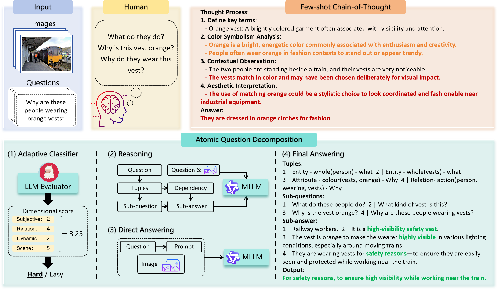

<<<<<<< HEAD
# Atomic Question Decomposition for Visual Question Answering

Code for our paper "Atomic Question Decomposition for Visual Question Answering".

<p align="center">
     <br>
  <p align="center" style="font-size:1.2vw;">Overall framework flowchart. The upper part illustrates how humans approach difficult questions through step-by-step reasoning, along with an erroneous example of few-shot CoT; red text indicates errors, while orange text highlights redundancy. The lower part presents our overall framework, green text indicates correct reasoning.</p>
</p>

## Contents
- [Install](#install)
- [Weights](#weights)
- [Inference](#inference)

## Install

1. Clone this repository and navigate to Attribute Polisher folder
```bash
git clone https://anonymous.4open.science/r/AQD-VQA/
cd AQD-VQA
```

2. Install Package
```Shell
conda create -n AQD python=3.10 -y
conda activate AQD
pip install --upgrade pip  # enable PEP 660 support
pip install -r requirements.txt
```

## Weights

We adopted LLaVA, Qwen-VL-Chat, and InternVL2 as our VLM baseline models, and employed Llama 3 as our text processing model.

For VLM models:
- [LLaVA](https://github.com/haotian-liu/LLaVA)
- [Qwen-VL-Chat](https://huggingface.co/Qwen/Qwen-VL-Chat)
- [InternVL2](https://huggingface.co/OpenGVLab/InternVL2-8B)

For Llama 3, please follow the guidance of [this](https://github.com/meta-llama/llama3) to download the weights of Meta-Llama-3-8B-Instruct.

## Inference

We evaluated the performance of our model on three benchmarks. Please download the datasets by following the instructions provided by the respective datasets.
- [VQA-Introspect](https://www.microsoft.com/en-us/research/project/vqa-introspect/)
- [A-OKVQA](https://github.com/allenai/aokvqa)
- [GQA](https://cs.stanford.edu/people/dorarad/gqa/)

1. Enter the folder of the dataset

```Shell
cd introspect
```

2. Run the classification routing module

```Shell
python classify_intros_llama3.py
```

3.  Simple questions are answered directly by the VLM model

```Shell
python vqa_intros_llava.py
```

3.  Complex questions are processed by the question decomposition reasoning module

```Shell
# Generate tuples and sub-questions
python tuple_decompose_intros_llama3.py
python sub_question_generation_llama3.py

# The VLM answers the sub-questions
python sub_answer_llava.py

# Integrate sub-QA pairs and generate the final answer to the original question
python evaluation_introspect_llava.py
```


=======
# AQD-VQA
>>>>>>> 1a6ae19b18b19b178435d58a70b8d4d0b1413fa8
